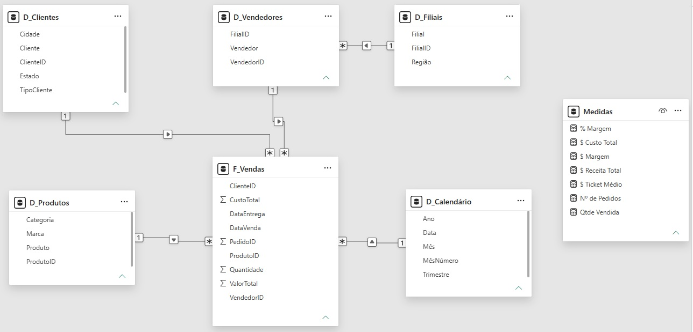

# 📊 Oracle AgroWater — Dashboard de Vendas

> Projeto de Business Intelligence desenvolvido em Power BI para análise do desempenho comercial de uma empresa fictícia do segmento de equipamentos e soluções para irrigação agrícola.

---

## 🎯 Objetivo

Desenvolver um dashboard para apoiar a diretoria comercial na análise de:

- Receita e margem;
- Volume de pedidos;
- Ticket médio;
- Desempenho de vendedores e filiais;
- Produtos e categorias;
- Marcas;
- Evolução das vendas ao longo do tempo.

---

## 🏢 Contexto

A **Oracle AgroWater** é uma empresa fictícia especializada na comercialização de equipamentos e soluções para irrigação agrícola.

O projeto considera uma estrutura comercial composta por filiais, vendedores, produtos, marcas e clientes distribuídos pelas regiões Sul, Sudeste, Centro-Oeste e Nordeste.

Os dados utilizados são **simulados** e foram desenvolvidos exclusivamente para fins de estudo e demonstração de conhecimentos em Business Intelligence.

---

## ❓ Perguntas de negócio

- Como a receita evolui ao longo do tempo?
- Quais categorias e produtos apresentam maior receita?
- Quais marcas possuem maior participação nas vendas?
- Quais vendedores apresentam melhor desempenho?
- Quais filiais geram maior receita e margem?
- Como está distribuída a receita entre as filiais?
- Qual é o volume de pedidos e o ticket médio?

---

## 📊 Dashboard

### Visão Geral

Visão consolidada do desempenho comercial, com evolução da receita, principais produtos e ranking de vendedores.


### Produtos

Análise de receita, margem e quantidade vendida por categoria, produto e marca.


### Comercial

Análise do desempenho das filiais e vendedores, incluindo receita, margem e ticket médio.


### Regionais

Análise da participação da receita, quantidade vendida, receita e margem por filial.


---

## 📈 Principais KPIs

| KPI | Objetivo |
|---|---|
| Receita Total | Acompanhar o faturamento |
| Margem | Avaliar o resultado das vendas |
| Nº de Pedidos | Medir o volume comercial |
| Ticket Médio | Avaliar a receita média por pedido |
| Quantidade Vendida | Acompanhar o volume de produtos vendidos |

---

## 🧠 Modelo de dados

O projeto utiliza **modelagem dimensional com modelo estrela**, tendo `F_Vendas` como tabela fato e dimensões para clientes, produtos, vendedores, filiais e calendário.



---

## 🧮 Exemplos de DAX

### Receita Total

```DAX
'$ Receita Total' =
SUM(F_Vendas[ValorTotal])
```

### Margem

```DAX
'$ Margem' =
[$ Receita Total] - [$ Custo Total]
```

### Número de Pedidos

```DAX
'Nº de Pedidos' =
DISTINCTCOUNT(F_Vendas[PedidoID])
```

### Ticket Médio

```DAX
'$ Ticket Médio' =
DIVIDE(
    [$ Receita Total],
    [Nº de Pedidos],
    0
)
```

---

## 🛠️ Tecnologias e técnicas

- Power BI
- Power Query
- DAX
- Modelagem dimensional
- Modelo estrela
- Excel
- KPIs e indicadores
- Visualização de dados
- Storytelling
- UX de dashboards

---

## 📌 Resultado

O projeto permitiu aplicar, de ponta a ponta, conceitos de **Business Intelligence**, desde a preparação e modelagem dos dados até a criação de medidas, indicadores, visualizações e análises orientadas ao negócio.

---

> **Projeto fictício:** a Oracle AgroWater e todos os dados apresentados neste projeto são simulados e foram desenvolvidos exclusivamente para fins de estudo e demonstração de conhecimentos em Business Intelligence.
